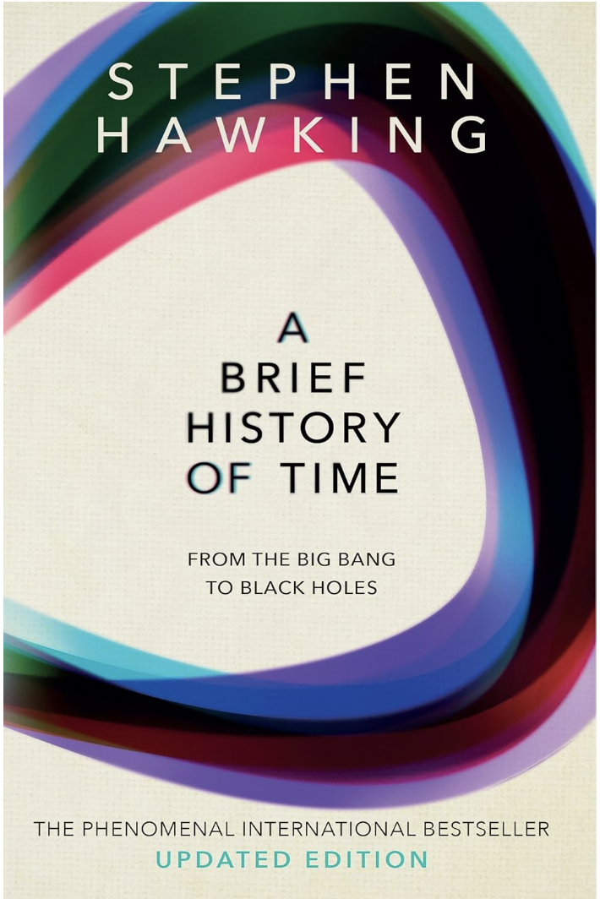

Motivation
==========

   *"... if we do discover a complete theory, it should in time be understandable
   in broad principle by everyone, not just a few scientists. Then we shall all,
   philosophers, scientists, and just ordinary people, be able to take part in
   the discussion of the question of why it is that we and the universe exist.
   If we find the answer to that, it would be the ultimate triumph of human
   reason — for then we would know the mind of God."*

   — Stephen Hawking, *A Brief History of Time*

|

