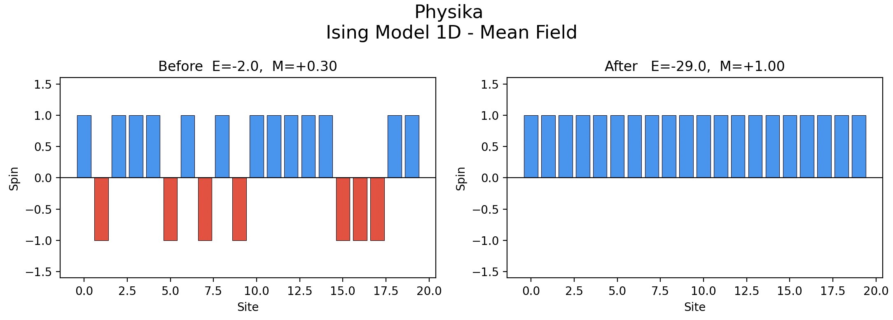
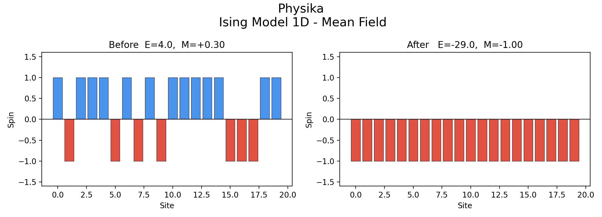
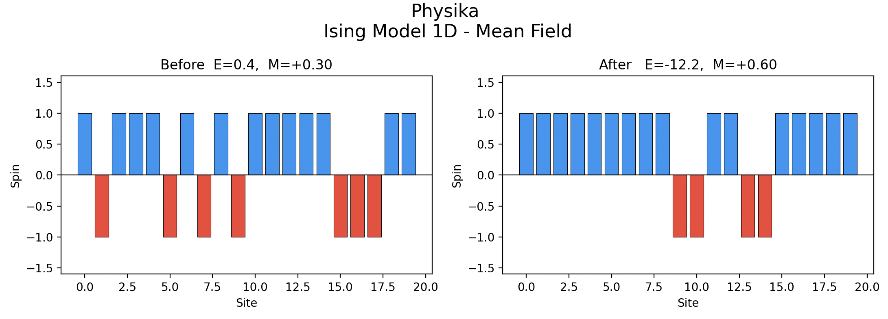

Ising Model
===========

This tutorial covers the physics of the 1D Ising model, mean-field theory, variational free energy,
stochastic computation graphs (SCGs), score-function (SF) estimator implemented in Physika.

The Ising Model
---------------

In statistical mechanics, the 1D Ising model simulates ferromagnetism [Peierls1936]_. It uses discrete
variables to represent atomic magnetic dipole moments ("spins" ), which are restricted
to one of two possible states: ``+1`` or ``-1``.

Consider a set of :math:`n` binary spins:

.. math::

   \sigma_i \in \{-1, +1\}, \quad i = 0, \ldots, n-1

The energy of a configuration :math:`{\sigma}` is given by the Ising Hamiltonian [`Wikipedia <https://en.wikipedia.org/wiki/Ising_model>`_]:

.. math::

   H(\boldsymbol{\sigma}) =
     -\sum_{\langle ij \rangle} J_{ij}\,\sigma_i \sigma_j
     \;-\; \mu \sum_{j} h_j\,\sigma_j

where :math:`\langle ij \rangle` denotes all pairs of nearest neighbours,
:math:`J_{ij}` is the coupling strength between sites :math:`i` and :math:`j`,
:math:`h_j` is the local external field at site :math:`j`, and :math:`\mu` is
the magnetic moment.

In our 1D Ising model, we make two simplifying assumptions:

1. **Uniform coupling**:
   all nearest-neighbour pairs have the same interaction strength, :math:`J_{ij} = J`.
2. **Uniform field**: 
   the external field is the same at every site, :math:`\mu h_j = h`.

We make another assumption for periodic boundary conditions (see
`UCI Lecture Notes <https://ps.uci.edu/~cyu/p115A/LectureNotes/Lecture18/html_version/lecture18.html>`_). Our spins configuration is arranged in a ring, so each site has exactly
two neighbours. With open boundaries, spins at right and left extremes, each have only one neighbour instead
of two. On a ring, we assume, that the probability of spins at any site is uniform.

By considering these assumptions, the Hamiltonian simplifies as follows:

.. math::

   H({\sigma}) = -J \sum_{i=0}^{n-1} \sigma_i \sigma_{i+1 \bmod n}
                             \;-\; h \sum_{i=0}^{n-1} \sigma_i

``i+1 mod n`` sub-index means that the last spin is a neighbour of the first, closing the spins chain
into a ring.

- :math:`J` is the coupling constant [``eV`` or ``J``].

   Its sign determines the type of magnetic phenomenon:

  - :math:`J > 0` (**ferromagnetic**): neighbouring spins lower their energy
    by aligning in the same direction. At low temperature the system favours
    a state where most spins point the same way.
    This is the case used in ``ising.phyk``.
  - :math:`J < 0` (**antiferromagnetic**): neighbouring spins lower their
    energy by pointing in *opposite* directions. The ground state is an
    alternating ``+1, -1, +1, -1, ...`` pattern.
  - :math:`J = 0` (**non-interacting spins**): no coupling between neighbours.
    The spins are completely independent and their state is determined only by
    the external field :math:`h`. There is no phase transition.

- :math:`h` is the external magnetic field [``eV`` or ``J``].
   
   A positive :math:`h` biases all spins toward :math:`+1` and a negative :math:`h` toward :math:`-1`.

In Physika the Hamiltonian is implemented as a function. The periodic boundary condition
is handled by noting that the last spin wraps around to the first:

.. code-block:: text

   def H(J: ℝ, h: ℝ, spins: ℝ[m], n: ℝ): ℝ:
       n: ℝ = n - 1
       nn_bulk : ℝ[n] = for i : ℕ(n) → spins[i] * spins[i + 1]
       nn_sum : ℝ = sum(nn_bulk) + spins[n] * spins[0]
       field_sum : ℝ = sum(spins)
       return - J * nn_sum - h * field_sum

``nn_bulk`` computes :math:`\sigma_i \sigma_{i+1}` for all bulk bonds, and
the ``spins[n] * spins[0]`` term closes the ring.

Boltzmann Distribution
----------------------

The Ising Hamiltonian (:math:`H({\sigma})`) tells us abouth the energy of a given spin
configuration, which affects the overall ferromagnetic behavior. It is also known that
temperature plays a crucial role in the system's magnetism. 

Boltzmann distribution, applied to the Ising model, states that a
configuration with lower energy is exponentially more likely to be observed
than one with higher energy, with the temperature controlling how sharp that
preference is. The mathematical expression for the probability of a configuration at thermal equilibrium is:

.. math::

   p(\boldsymbol{\sigma}) = \frac{e^{-\beta H(\boldsymbol{\sigma})}}{Z},
   \qquad
   Z = \sum_{\boldsymbol{\sigma}} e^{-\beta H(\boldsymbol{\sigma})}

Where :math:`\beta` :math:`(1 / k_B T)` is the inverse temperature [``eV^-1`` or ``J^-1``]. :math:`k_B = 1.38 \times 10^{-23}` [``J/K``] is the Boltzmann constant and :math:`T` is the absolute temperature in ``K``. Large :math:`\beta`, lower :math:`T`, drives the system toward order and small :math:`\beta`, higher :math:`T`, drives the system toward disorder.

The partition function :math:`Z` is a sum over spin
configurations. Each of the :math:`n` sites independently takes one of 2
values (:math:`+1` or :math:`-1`), so there
are :math:`2^n` configurations in total.
For :math:`n = 20` that is already :math:`2^{20} = 1{,}048{,}576` terms!
Computing :math:`Z` exactly is therefore infeasible for any realistic system size.

Mean-field theory replaces the exact, and computationally expensive, distribution with an
approximation from a group simple distributions.

Mean-Field Theory
-----------------

Mean field theory gives us a simple distribution
:math:`q` that we can actually work with. The true equilibrium distribution :math:`p` is intractable as :math:`n` spins increases , and :math:`q({\sigma})` is our approximation to :math:`p`. We choose
:math:`q` to be as simple as possible while still being able to capture the
relevant physics. The mean-field theory lets us assume that spins are
independent of each other:

.. math::

   q(\boldsymbol{\sigma}) = \prod_{i=0}^{n-1} q_i(\sigma_i)

Instead of one large distribution over all
:math:`2^n` configurations, we have :math:`n` independent single spin
distributions.

Each spin :math:`\sigma_i \in \{-1, +1\}` can take only two values, so
:math:`q_i` is a Bernoulli distribution with a single parameter
:math:`p_i = \Pr(\sigma_i = +1)`:

.. math::

   q_i(\sigma_i) = p_i^{\frac{1+\sigma_i}{2}} \,(1-p_i)^{\frac{1-\sigma_i}{2}}

Because :math:`J` and :math:`h` are the same at every site and given the PBC, we therefore assume:

.. math::

   p_i = p \quad \text{for all } i

This collapses the :math:`n` independent Bernoulli parameters into a
single scalar :math:`p \in (0, 1)`. In Physika we have included :math:`p` as ``logit_p``
as the learnable parameter. The probability :math:`p` is
recovered from logit :math:`\ell` via sigmoid function:

.. math::

   p = \sigma(\ell) = \frac{1}{1 + e^{-\ell}}

where :math:`\ell` is ``this.logit_p``.

The expected spin value under :math:`q_i` is the magnetisation :math:`m`:

.. math::

   m = \mathbb{E}_{q_i}[\sigma_i] = (+1)\cdot p + (-1)\cdot(1-p) = 2p - 1

If :math:`m = 1` all spins are aligned to an upward position,
:math:`m = -1` spins pointing down and :math:`m = 0` describes a disordered state.

Free Energy
-----------

We want to find the distribution :math:`q` that is as close as possible 
to the Boltzmann distribution :math:`p`. For this reason, we use the Kullback–Leibler (KL)
divergence, which is a measure of the difference between distributions. In our case,
KL divergenece between :math:`q` and :math:`p` distributions is:

.. math::

   \mathrm{KL}(q \| p)
   = \sum_{\boldsymbol{\sigma}} q(\boldsymbol{\sigma})
     \ln \frac{q(\boldsymbol{\sigma})}{p(\boldsymbol{\sigma})}

Substituting the Boltzmann distribution
:math:`p(\boldsymbol{\sigma}) = e^{-\beta H(\boldsymbol{\sigma})} / Z`:

.. math::

   \ln \frac{q(\boldsymbol{\sigma})}{p(\boldsymbol{\sigma})}
   = \ln q(\boldsymbol{\sigma}) - \ln p(\boldsymbol{\sigma})
   = \ln q(\boldsymbol{\sigma}) + \beta H(\boldsymbol{\sigma}) + \ln Z

Now KL sum can be expressed as a sum of three terms:

.. math::

   \mathrm{KL}(q \| p)
   = \underbrace{\sum_{\boldsymbol{\sigma}}
       q(\boldsymbol{\sigma})\ln q(\boldsymbol{\sigma})}_{-S(q)}
   + \beta \underbrace{\sum_{\boldsymbol{\sigma}}
       q(\boldsymbol{\sigma})\,H(\boldsymbol{\sigma})}_{\langle H \rangle_q}
   + \ln Z \underbrace{\sum_{\boldsymbol{\sigma}}
       q(\boldsymbol{\sigma})}_{=\,1}

Therefore:

.. math::

   \mathrm{KL}(q \| p) =  - S(q) + \beta \langle H \rangle_q + \ln Z

where:

- :math:`\langle H \rangle_q = \mathbb{E}_q[H(\boldsymbol{\sigma})]` is the
  average energy given spins are drawn from :math:`q`.
- :math:`S(q) = -\sum_{\boldsymbol{\sigma}} q(\boldsymbol{\sigma})
  \ln q(\boldsymbol{\sigma})` is the Shannon entropy of :math:`q`,
  measuring how spread out or disordered it is.
- :math:`\ln Z` is a constant with respect to :math:`q`.

Because :math:`\ln Z` is independent of :math:`q`, minimising
:math:`\mathrm{KL}(q \| p)` over :math:`q` is identical to minimising:

.. math::

   G(p) = \beta \langle H \rangle_q - S(q)

Where
:math:`\langle H \rangle_q` is an average over samples drawn from
:math:`q`, and :math:`S(q)` has a closed form for Bernoulli distributions.

Dividing by :math:`n` gives the per-site free energy:

.. math::

   \frac{G(p)}{n}
   = \beta \frac{\langle H \rangle_q}{n}
     - \frac{S(q)}{n}

The energy term (:math:`\beta \langle H \rangle_q / n`) is minimised by
putting all probability on the lowest-energy configuration (all spins
aligned). It wants :math:`p \to 1` or :math:`p \to 0`.
On the other hand, the entropy term (:math:`-S(q)/n`) is minimised when the distribution is
as spread out as possible. It wants :math:`p = 0.5`.
:math:`\beta` controls the balance: large :math:`\beta` (low temperature)
amplifies the energy term and drives order; small :math:`\beta` (high
temperature) amplifies entropy and drives disorder.

**Entropy of the factorised Bernoulli distribution**

For independent spins :math:`q = \prod_i \mathrm{Bernoulli}(p)`, entropy is
additive across sites:

.. math::

   S(q) = \sum_{i=0}^{n-1} S(q_i)
        = \sum_{i=0}^{n-1} \bigl[-p \ln p - (1-p)\ln(1-p)\bigr]
        = -n\bigl[p \ln p + (1-p)\ln(1-p)\bigr]

Each single-site binary entropy :math:`S(q_i) = -p \ln p - (1-p)\ln(1-p)`
equals 0 when :math:`p \in \{0,1\}`  and reaches its
maximum :math:`\ln 2` at :math:`p = 0.5`, random sampled spins.

Then, the negative entropy per site that appears in the loss is:

.. math::

   -\frac{S(q)}{n} = p \ln p + (1-p) \ln(1-p)

In Physika:

.. code-block:: text

   def neg_entropy_per_site(p: ℝ): ℝ:
       return p * log(p) + (1.0 - p) * log(1.0 - p)

The Mean-Field Self-Consistency Equation
-----------------------------------------

We derive the self-consistency equation by setting :math:`\partial G / \partial p = 0`.

Under the factorised :math:`q`, neighbouring spins are independent, so:

.. math::

   \langle \sigma_i \sigma_{i+1} \rangle_q = \langle \sigma_i \rangle_q \langle \sigma_{i+1} \rangle_q = m^2

The ring has :math:`n` bonds, so:

.. math::

   \frac{\langle H \rangle_q}{n} = -J m^2 - h m

Substituting :math:`m = 2p-1` into :math:`G(p)/n`

.. math::

   \frac{G(p)}{n}
   = \beta\bigl(-J(4p^2 - 4p + 1) - h(2p-1)\bigr)
     + p \ln p + (1-p)\ln(1-p)

.. math::

   = \beta(-4Jp^2 + 4Jp - J - 2hp + h)
     + p \ln p + (1-p)\ln(1-p)

Differentiating with respect to :math:`p`:

.. math::

   \frac{1}{n}\frac{\partial G}{\partial p}
   = \beta(-8Jp + 4J - 2h) + \ln\frac{p}{1-p} = 0

Rearranging and factoring:

.. math::

   \ln\frac{p}{1-p} = \beta(8Jp - 4J + 2h) = 2\beta(4Jp - 2J + h) = 2\beta\bigl(2J(2p-1) + h\bigr)

Then, replace :math:`p` with :math:`m` knowing that :math:`m = 2p-1`:

.. math::

   \ln\frac{1+m}{1-m} = 2\beta(2Jm + h)

Since:

.. math::
   \text{arctanh}(m) = \frac{1}{2} \ln \left( \frac{1 + m}{1 - m} \right)

The mean-field self-consistency equation is:

.. math::

   m = \tanh\!\bigl(\beta (2 J m + h)\bigr)

The equation can be solved iteratively starting from :math:`m = 0` and apply the
right hand side repeatedly until convergence. In Physika, we implemented `mean_field_reference` function:

.. code-block:: text

   def mean_field_reference(J: ℝ, h: ℝ, β: ℝ, iters: ℕ): ℝ:
       m : ℝ = 0.0
       for it : ℕ(iters):
           m = tanh(β * (2.0 * J * m + h))
       return (1.0 + m) * 0.5     # From magnetisation (m) to probability of spin up (p)

We use this as a ground-truth reference. After training, ``p_after`` should
match ``p_ref``.

Gradient Descent on the Free Energy
------------------------------------

Instead of solving the self-consistency equation we minimise :math:`G(p)/n`
by gradient descent.
The learnable parameter is :math:`p`, but we parameterise it through :math:`\ell` (``logit_p``) to ensure it stays in the valid range (0, 1). The logit is the inverse sigmoid of :math:`p`:

.. math::

   \ell = \ln \frac{p}{1-p}
   \implies
   p = \sigma(\ell) = \frac{1}{1 + e^{-\ell}}

In Physika, ``MeanFieldIsing`` class manages ``logit_p`` as a learnable parameter:

.. code-block:: text

   class MeanFieldIsing(logit_p: ℝ):

and recovers :math:`p` anywhere it is needed by applying the sigmoid function to ``this.logit_p``:

.. code-block:: text

   p : ℝ = 1.0 / (1.0 + exp(-this.logit_p))

Stochastic Computation Graphs (SCGs)
------------------------------------

A stochastic computation graph (SCG) is a directed
graph whose nodes are either [Schulman2015]_:

- Deterministic nodes: Smooth functions whose gradients flow
  through by standard backpropagation.
- Stochastic nodes: Random samples drawn from a distribution. Gradients do not flow through sampling directly.

The entropy term :math:`-S(q)/n` is a smooth function of :math:`p = \sigma(\ell)`,
so its gradient is computed exactly by autodiff. The challenge is the energy term:

.. math::

   \nabla_\ell \,\mathbb{E}_{q(\boldsymbol{\sigma};\ell)}\!\left[\frac{H(\boldsymbol{\sigma})}{n}\right]

The distribution :math:`q` depends on :math:`\ell` through :math:`p = \sigma(\ell)`, and
:math:`{\sigma}` is discrete. We cannot write the sampling as a smooth
function of :math:`\ell` and differentiate through it.

Score-Function Estimator
~~~~~~~~~~~~~~~~~~~~~~~~~~~~

For discrete distributions we use the score-function estimator [Schulman2015]_:

.. math::

   \nabla_\theta \,\mathbb{E}_{q(\mathbf{x};\theta)}\!\bigl[f(\mathbf{x})\bigr]
   = \mathbb{E}_{q(\mathbf{x};\theta)}\!\Bigl[f(\mathbf{x})\,\nabla_\theta \ln q(\mathbf{x};\theta)\Bigr]

The derivation comes from log-derivative trick:

.. math::

   \nabla_\theta \sum_{\mathbf{x}} q(\mathbf{x};\theta)\,f(\mathbf{x})
   = \sum_{\mathbf{x}} f(\mathbf{x})\,\nabla_\theta q(\mathbf{x};\theta)
   = \sum_{\mathbf{x}} f(\mathbf{x})\,q(\mathbf{x};\theta)\,
     \frac{\nabla_\theta q(\mathbf{x};\theta)}{q(\mathbf{x};\theta)}
   = \mathbb{E}_q\!\bigl[f(\mathbf{x})\,\nabla_\theta \ln q(\mathbf{x};\theta)\bigr]

The term :math:`\nabla_\theta \ln q(\mathbf{x};\theta)` is
the gradient of the log-probability, referred as score-function. It is computable even when
:math:`f` is non-differentiable or :math:`\mathbf{x}` is discrete.

For :math:`q_i = \mathrm{Bernoulli}(p)` with :math:`p = \sigma(\ell)`:

.. math::

   \ln q(\boldsymbol{\sigma}; \ell)
   = \sum_{i=0}^{n-1} \bigl[b_i \ln p + (1-b_i)\ln(1-p)\bigr]

where :math:`b_i = (\sigma_i + 1)/2 \in \{0, 1\}` comes from a Bernoulli distribution. In Physika, we can draw from Bernoulli distibution as follows:

.. code-block:: text

   b_s : ℝ[n] ~ Bernoulli(p, n)

The score-function is:

.. math::

   \nabla_\ell \ln q = \frac{\partial}{\partial \ell} \ln q
   = \sum_{i=0}^{n-1} (b_i - p)

Variance Reduction via a Baseline
----------------------------------

The score-function estimator can have high variance
because :math:`f({\sigma})` may vary across samples. We can reduce variance by introducing
a baseline that does not change the expected value of the gradient.

For any constant :math:`b` (the *baseline*):

.. math::

   \mathbb{E}_q\!\bigl[(f(\mathbf{x}) - b)\,\nabla_\theta \ln q\bigr]
   = \mathbb{E}_q\!\bigl[f(\mathbf{x})\,\nabla_\theta \ln q\bigr]
   - b\,\underbrace{\mathbb{E}_q\!\bigl[\nabla_\theta \ln q\bigr]}_{=\,0}
   = \mathbb{E}_q\!\bigl[f(\mathbf{x})\,\nabla_\theta \ln q\bigr]

The baseline subtracts from the objective without changing the expected
gradient, but it can reduce variance if it is close to
:math:`\mathbb{E}_q[f]`.

A good baseline is a running average of the function value. Here we use an
exponential moving average (EMA) of the per-site energy:

.. math::

   b_{t+1} = 0.9 \cdot b_t + 0.1 \cdot \frac{H(\boldsymbol{\sigma})}{n}

In Physika, EMA baseline is stored as a class field and updated after each
gradient step:

.. code-block:: text

   this.baseline = 0.9 * this.baseline + 0.1 * mean_energy_ps

The Gradient Decomposition
---------------------------

The total gradient of :math:`G(p)/n` splits into two terms:

.. math::

   \nabla_\ell \frac{G(p)}{n}
   = \underbrace{\beta \,\mathbb{E}_q\!\Bigl[\frac{H}{n}\,\nabla_\ell \ln q\Bigr]}_{\text{score-function term}}
   + \underbrace{\nabla_\ell \Bigl(-\frac{S(q)}{n}\Bigr)}_{\text{analytic term}}

The Hamiltonian depends on
discrete spins, so we use the score estimator with a baseline:

.. math::

   \beta \,\mathbb{E}_q\!\Bigl[\Bigl(\frac{H}{n} - b\Bigr) \nabla_\ell \ln q\Bigr]

In Physika this is:

.. code-block:: text

   energy_ps : ℝ = H(J, h, spins, size) / n
   log_prob : ℝ = sum(for i : ℕ(n) → b[i] * log(p) + (1.0 - b[i]) * log(1.0 - p))
   energy_term : ℝ = β * (energy_ps - this.baseline) * log_prob

Only ``log_prob`` carries the gradient :math:`\nabla_\ell \ln q`, as it includes ``p`` which depends on the learnable parameter ``logit_p``, and ``energy_ps - this.baseline`` acts as a
multiplicative weight.

The negative entropy :math:`p \ln p + (1-p)
\ln(1-p)` is a smooth deterministic function of :math:`p = \sigma(\ell)`,
so its gradient is computed exactly by autodiff:

.. code-block:: text

   entropy_term : ℝ = neg_entropy_per_site(p)

The total loss returned by the ``loss`` method is:

.. code-block:: text

   return energy_term + entropy_term

Sampling Spins
--------------

The ``λ`` method is the forward pass of the ``MeanFieldIsing`` class. It receives the
number of sites :math:`n` and returns a sample of spin configurations
:math:`{\sigma} \in \{-1, +1\}^n`:

.. code-block:: text

   def λ(n: ℕ) → ℝ[n]:
       p : ℝ = 1.0 / (1.0 + exp(-this.logit_p))
       b_s : ℝ[n] ~ Bernoulli(p, n)
       spins : ℝ[n] = for i : ℕ(n) → 2.0 * b_s[i] - 1.0
       return spins

1. Recover :math:`p` from the logit parameter using sigmoid.
2. Draw :math:`n` Bernoulli samples: :math:`b_i \sim \mathrm{Bernoulli}(p)`.
3. Convert bits to spins: :math:`\sigma_i = 2 b_i - 1`.

Score-Function Loss
-------------------

The ``loss`` method takes a previously drawn spin configuration (detached from gradient tape)
and computes the SCG loss:

.. code-block:: text

   def loss(spins: ℝ[n], J: ℝ, h: ℝ, β: ℝ, size: ℝ) → ℝ:
       p : ℝ = 1.0 / (1.0 + exp(-this.logit_p))
       b : ℝ[n] = for i : ℕ(n) → (spins[i] + 1.0) * 0.5
       energy_ps : ℝ = H(J, h, spins, size) / n
       log_prob : ℝ = sum(for i : ℕ(n) → b[i] * log(p) + (1.0 - b[i]) * log(1.0 - p))
       energy_term : ℝ = β * (energy_ps - this.baseline) * log_prob
       entropy_term : ℝ = neg_entropy_per_site(p)
       return energy_term + entropy_term

``spins`` do not carry gradients since they were drawn in ``λ``.
We recover the bit representation ``b`` from the spins so that ``log_prob``
is differentiable in :math:`p`, and therefore
in ``logit_p``.

Stochastic Gradient Descent Training Loop
-----------------------------------------

During training, each iteration averages the loss over ``n_batch`` independently drawn spin configurations:

.. code-block:: text

   def train(n: ℕ, n_steps: ℕ, n_batch: ℕ, lr: ℝ, J: ℝ, h: ℝ, β: ℝ, size: ℕ):
       spins_0 = this(n)
       this.baseline = H(J, h, spins_0, size) / n
       for step : ℕ(n_steps):
           batch_loss = 0.0
           mean_energy_ps = 0.0
           for k : ℕ(n_batch):
               spins = this(n)
               mean_energy_ps = mean_energy_ps + H(J, h, spins, size) / n / n_batch
               batch_loss = batch_loss + this.loss(spins, J, h, β, size) / n_batch
           grads = grad(batch_loss, this.params)
           this.baseline = 0.9 * this.baseline + 0.1 * mean_energy_ps
           this.update(lr, grads)

For each step, loop over ``n_batch`` mini-batch samples. Each call to
``this(n)`` draws a fresh independent spin configuration. Compute gradients via ``grad(batch_loss, this.params)``. Physika traces
through ``batch_loss`` and differentiates with respect to all trainable
parameters of the model (just ``logit_p`` in this case). 
After computing the gradient, baseline is updated, so it is
constant with respect to the current sample. Update learnable parameters via ``this.update(lr, grads)``.

Examples
---------

Below is an example of training the mean-field Ising model with the following parameters:

.. code-block:: text

   n : ℕ = 20
   J : ℝ = 1.0
   h : ℝ = 0.5
   β : ℝ = 5.0
   steps : ℕ = 100
   batch : ℕ = 32
   logit_init : ℝ = 0.0 # p = 0.5 (random spins)
   lr : ℝ = 0.05

- :math:`n = 20` sites, :math:`J = 1.0` (ferromagnetic), :math:`h = 0.5`
  (field pointing up).
- :math:`\beta = 5.0`, low temperature favours ordered states.
- ``logit_init = 0.0``, :math:`p = 0.5`, meaning maximum entropy, all spins
  random.
- 100 gradient steps with mini-batches of 32 configurations and learning rate
  0.05.

Computing the magnetisation before and after training and compares
it to the analytic mean-field reference:

.. code-block:: text

   ising : MeanFieldIsing = MeanFieldIsing(logit_init)
   p_before : ℝ = 1.0 / (1.0 + exp(0.0 - ising.logit_p))
   spins_before : ℝ[n] = ising(n)
   ising.train(n, steps, batch, lr, J, h, β, n)
   p_after : ℝ = 1.0 / (1.0 + exp(0.0 - ising.logit_p))
   p_ref   : ℝ = mean_field_reference(J, h, β, 200)

   p_before     # sigmoid(0) = 0.5
   p_after      # mean-field solution
   p_ref        # reference

.. code-block:: text

     ✓ No type errors found
   0.5 ∈ ℝ
   0.9705318808555603 ∈ ℝ
   1.0 ∈ ℝ

After training ``p_after ≈ p_ref``. With :math:`J=1`, :math:`h=0.5`,
:math:`\beta=5` the analytic solution gives :math:`p_{\rm after} \approx 0.97`,
meaning almost all spins point up. This results aligns with the ferromagnetic coupling and
external field values.

   Figure 1: Spin configurations before and after training with :math:`n = 20` sites,
   :math:`J = 1.0`, :math:`h = 0.5`, and :math:`\beta = 5.0`.

Spin configurations sampled from ``MeanFieldIsing`` before training (random,
:math:`p \approx 0.5`) and after training (:math:`p \approx 0.97`, almost all spins up).

Consider the same parameters, but lets change the direction of the external field to :math:`h = -0.5` (pointing down). The mean-field solution should point down (spins aligned to `-1`).

   Figure 2: Spin configurations before and after training with :math:`n = 20` sites,
   :math:`J = 1.0`, :math:`h = -0.5`, and :math:`\beta = 5.0`.

.. code-block:: text

      ✓ No type errors found
   0.5 ∈ ℝ
   0.0121584078297019 ∈ ℝ
   0.0 ∈ ℝ

Before training (random,
:math:`p \approx 0.5`) and after training (:math:`p \approx 0.012`, almost all spins down), while reference gives ``0.0``.

Now, lets consider a more challenging case where we have a weaker external field :math:`h = 0.1` and higher temperature :math:`\beta = 1.0`.
The mean-field solution should be more disordered with :math:`p` closer to 0.5.

   Figure 3: Spin configurations before and after training with :math:`n = 20` sites,
   :math:`J = 1.0`, :math:`h = 0.1`, and :math:`\beta = 1.0`.

.. code-block:: text

      ✓ No type errors found
   0.5 ∈ ℝ
   0.6389197707176208 ∈ ℝ
   0.9831268787384033 ∈ ℝ

Before training (random,
:math:`p \approx 0.5`) and after training (:math:`p \approx 0.639`, disordered due to higher temperature and lower field strength), while reference gives ``0.983`` indicating a decrease from ordered state.

.. note::

   The plots below are produced by ``plot_ising_result``, which is not included
   in Physika by default. To reproduce them, add the following function to
   ``physika/runtime.py``:

   .. code-block:: python

      def plot_ising_result(spins_before, spins_after, J, h):
          import matplotlib.pyplot as plt
          J, h = float(J), float(h)

          def energy(spins):
              return float(-J * torch.sum(spins[:-1] * spins[1:]) - h * torch.sum(spins))

          def mag(spins):
              return float(torch.mean(spins))

          def colors(spins):
              return ['#2196F3' if s > 0 else '#F44336' for s in spins.tolist()]

          n = len(spins_before)
          fig, (ax0, ax1) = plt.subplots(1, 2, figsize=(11, 4))
          fig.suptitle("Physika\n Ising Model 1D - Mean Field", fontsize=16)

          ax0.bar(range(n), spins_before.tolist(),
                  color=colors(spins_before), edgecolor='k', linewidth=0.4)
          ax0.set_title(f'Before  E={energy(spins_before):.1f},  M={mag(spins_before):+.2f}')
          ax0.set_ylim(-1.6, 1.6); ax0.axhline(0, color='k', lw=0.8)
          ax0.set_ylabel('Spin'); ax0.set_xlabel('Site')

          ax1.bar(range(n), spins_after.tolist(),
                  color=colors(spins_after), edgecolor='k', linewidth=0.4)
          ax1.set_title(f'After   E={energy(spins_after):.1f},  M={mag(spins_after):+.2f}')
          ax1.set_ylim(-1.6, 1.6); ax1.axhline(0, color='k', lw=0.8)
          ax1.set_ylabel('Spin'); ax1.set_xlabel('Site')

          plt.tight_layout()
          try:
              plt.show()
          except Exception as exc:
              print(f"[plot_ising_result] {exc}")

Full Code
---------

.. code-block:: text

   # 1D Ising model
   physika.seed(0)

   # helper function
   def tanh(z: ℝ): ℝ:
      num: ℝ = exp(z) - exp(-z)
      denom: ℝ = exp(z) + exp(- z)
      res: ℝ = num/denom
      return res

   # Ising Hamiltonian
   def H(J: ℝ, h: ℝ, spins: ℝ[m], n: ℝ): ℝ:
      n: ℝ = n - 1
      nn_bulk : ℝ[n] = for i : ℕ(n) → spins[i] * spins[i + 1]
      nn_sum : ℝ = sum(nn_bulk) + spins[n] * spins[0]   # ring geometric condition
      field_sum : ℝ = sum(spins)
      return - J * nn_sum - h * field_sum

   # negative entropy of the factorised [S(q)]
   def neg_entropy_per_site(p: ℝ): ℝ:
      return p * log(p) + (1.0 - p) * log(1.0 - p)

   def mean_field_reference(J: ℝ, h: ℝ, β: ℝ, iters: ℕ): ℝ:
      m : ℝ = 0.0
      for it : ℕ(iters):
         m = tanh(β * (2.0 * J * m + h))
      return (1.0 + m) * 0.5

   class MeanFieldIsing(logit_p: ℝ):
      baseline : ℝ
      def λ(n: ℕ) → ℝ[n]:
         p : ℝ = 1.0 / (1.0 + exp(-this.logit_p))
         b_s : ℝ[n] ~ Bernoulli(p, n)
         spins : ℝ[n] = for i : ℕ(n) → 2.0 * b_s[i] - 1.0
         return spins
      def loss(spins: ℝ[n], J: ℝ, h: ℝ, β: ℝ, size: ℝ) → ℝ:
         p : ℝ = 1.0 / (1.0 + exp(-this.logit_p))
         b : ℝ[n] = for i : ℕ(n) → (spins[i] + 1.0) * 0.5
         energy_ps : ℝ = H(J, h, spins, size) / n
         log_prob : ℝ = sum(for i : ℕ(n) → b[i] * log(p) + (1.0 - b[i]) * log(1.0 - p))
         energy_term : ℝ = β * (energy_ps - this.baseline) * log_prob
         entropy_term : ℝ = neg_entropy_per_site(p)
         return energy_term + entropy_term
      def train(n: ℕ, n_steps: ℕ, n_batch: ℕ, lr: ℝ, J: ℝ, h: ℝ, β: ℝ, size: ℕ):
         spins_0 = this(n)
         this.baseline = H(J, h, spins_0, size) / n
         for step : ℕ(n_steps):
               batch_loss = 0.0
               mean_energy_ps = 0.0
               for k : ℕ(n_batch):
                  spins = this(n)
                  mean_energy_ps = mean_energy_ps + H(J, h, spins, size) / n / n_batch
                  batch_loss = batch_loss + this.loss(spins, J, h, β, size) / n_batch
               grads = grad(batch_loss, this.params)
               this.baseline = 0.9 * this.baseline + 0.1 * mean_energy_ps
               this.update(lr, grads)

   n : ℕ = 20
   J : ℝ = 1.0
   h : ℝ = 0.5
   β : ℝ = 5.0
   steps : ℕ = 100
   batch : ℕ = 32
   logit_init : ℝ = 0.0
   lr : ℝ = 0.05

   ising : MeanFieldIsing = MeanFieldIsing(logit_init)

   p_before : ℝ = 1.0 / (1.0 + exp(0.0 - ising.logit_p))
   spins_before : ℝ[n] = ising(n)

   ising.train(n, steps, batch, lr, J, h, β, n)

   p_after : ℝ = 1.0 / (1.0 + exp(0.0 - ising.logit_p))
   p_ref   : ℝ = mean_field_reference(J, h, β, 200)
   spins_after : ℝ[n] = ising(n)

   p_before     # sigmoid(0) = 0.5
   p_after      # mean-field solution
   p_ref        # reference
   plot_ising_result(spins_before, spins_after, J, h)

References
----------

.. [Schulman2015] Schulman, J., Heess, N., Weber, T., and Abbeel, P. Gradient
   estimation using stochastic computation graphs. *NeurIPS*, 2015.
   `arXiv:1506.05254 <https://arxiv.org/abs/1506.05254>`_.

.. [Peierls1936] Peierls, R. On Ising’s model of ferromagnetism. *Mathematical
   Proceedings of the Cambridge Philosophical Society*, 32(3):477–481, 1936.
   doi: `10.1017/S0305004100019174 <https://doi.org/10.1017/S0305004100019174>`_.

