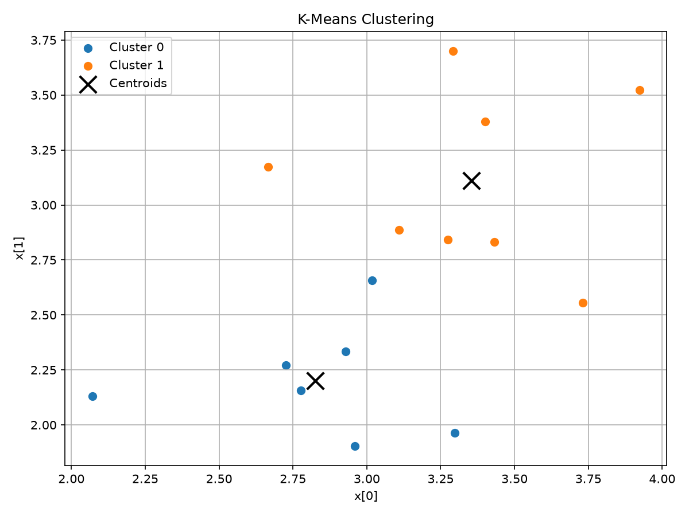

K-Means Clustering (Lloyd's algorithm)
======================================

In this tutorial we are going to explore kmeans algorithm and understand how it
can be used to discover groups within a dataset. It is widely used in customer
segmentation, anomaly detection, and recommendation systems. K-Means is an
unsupervised machine learning algorithm used to partition a dataset into a
fixed number of groups called `clusters`. The objective is to have clusters
which contains points which are similar to each other. [Lloyd1982]_

.. note::
   Unsupervised: A class of machine learning problems where the algorithm
   learns structure from data that has no labeled outcomes to predict.

   Lloyd's algorithm: The specific iterative procedure (alternating assignment
   and update steps) used to solve the K-Means clustering problem. In practice
   `K-Means` and `Lloyd's algorithm` are used interchangeably, though other
   algorithms exist for solving the same objective.

.. figure:: ../_static/tutorial_files/K_Means.svg
   :align: center
   :width: 50%
   :alt: Converged state of k-means algorithm.

   Figure 1: Converged state of k-means algorithm. [WestonPace]_

Algorithm
---------

Given a dataset :math:`X = {x_1, x_2, \ldots, x_n}` and a desired number of
clusters :math:`k`, K-Means proceeds as follows:

1. Initialize :math:`k` centroids :math:`\mu_1, \mu_2, \ldots, \mu_k`.

2. Assign each data point :math:`x_i` to the nearest centroid:

    .. math::

        c_i \leftarrow \underset{j \in \{1, \ldots, k\}}{\operatorname{argmin}}
        \|x_i - \mu_j\|^2

3. Update each centroid :math:`c_i` by taking the mean of all the points
   assigned to it:

    .. math::

        \mu_j \leftarrow
        \frac{1}{|\{i : c_i = j\}|}
        \sum_{i:c_i=j} x_i

4. Repeat steps 2 and 3 until the clusters assignments converge.

.. code:: text

   def kmeans(X: ℝ[NPTS, DIM]): ℝ[K, DIM]:
       lo_box, hi_box: ℝ[DIM] = data_min(X), data_max(X)
       C: ℝ[K, DIM] = for j:ℕ(K) -> rand_centroid(lo_box, hi_box)
       prev_labels: ℝ[NPTS] = for i:ℕ(NPTS) -> i * 0.0 - 1.0
       labels: ℝ[NPTS] = for i:ℕ(NPTS) -> i * 0.0
       converged_at: ℝ = 0.0 - 1.0
       for step:ℕ(ITERS):
           labels = assign_labels(X, C)
           moved = get_sum_of_1d_array(absolute(labels - prev_labels))
           if moved == 0.0:
               if converged_at < 0.0:
                   converged_at = step
           else:
               C = update_centroids(X, labels, C)
           prev_labels = labels
       return C

.. note::
   Centroid: In mathematics and physics, the centroid, also known as geometric
   center or center of figure, of a plane figure or solid figure is the mean
   position of all the points in the figure. [CentroidWikipedia]_

Centroid Initialization
------------------------

Before any points can be assigned, K-Means needs a starting position for each
of the :math:`k` centroids (step 1 of the algorithm above). This
implementation picks each initial centroid uniformly at random from within
the bounding box of the dataset.

.. math::

   \mu_j \sim \mathcal{U}(\text{lo}, \text{hi}), \qquad
   \text{lo} = \operatorname{data\_min}(X), \quad
   \text{hi} = \operatorname{data\_max}(X)

.. code-block:: text

   def rand_centroid(lo: ℝ[DIM], hi: ℝ[DIM]): ℝ[DIM]:
       s: ℝ[DIM] ~ 𝒰(0.0, 1.0, DIM)
       return lo + s * (hi - lo)

.. note::
   Bounding box: The smallest axis-aligned box that contains a set of
   points, defined by the element-wise minimum (``lo``) and maximum
   (``hi``) coordinates across the dataset. Sampling within it is a simple
   way to place initial centroids somewhere near the data.

Distance and Cluster Assignment
-------------------------------

The first step of each K-Means iteration is to assign every data point to the
nearest centroid. This requires computing the distance between a point and each
centroid and selecting the centroid with the smallest distance.

Squared Euclidean Distance
~~~~~~~~~~~~~~~~~~~~~~~~~~

Euclidean distance is the ordinary straight-line distance between two points in
space, computed via the Pythagorean theorem. It is the most common way of
measuring how `close` two points are in K-Means clustering.

For a point :math:`x` and centroid :math:`\mu`, the squared Euclidean distance
is

.. math:: d(x, \mu) = \|x - \mu\|^2 = \sum_{c=1}^{D} (x_c - \mu_c)^2

where :math:`D` is the number of dimensions.

The square root normally used in Euclidean distance is not required here
because the square-root function is monotonic. Therefore, the centroid that
minimizes the squared distance is also the centroid that minimizes the
Euclidean distance.

.. code:: text

   def sq_dist(a: ℝ[DIM], b: ℝ[DIM]): ℝ:
       acc: ℝ = 0.0
       for c:ℕ(DIM):
           acc += (a[c] - b[c]) * (a[c] - b[c])
       return acc

.. note::
   Monotonic: A function that never changes direction, it is either
   always non-decreasing or always non-increasing as its input grows.
   Because square root is monotonic, comparing squared distances gives the
   same ordering as comparing actual distances, so the square root can be
   safely skipped.

Finding the Nearest Centroid
~~~~~~~~~~~~~~~~~~~~~~~~~~~~

After initializing the centroids, each data point is assigned to the centroid
that is closest to it. For a data point :math:`x_i`, the assigned cluster is
determined by computing its squared Euclidean distance to every centroid and
selecting the centroid with the smallest distance.

.. math::

    c_i =
    \underset{j \in \{1,\ldots,k\}}{\operatorname{argmin}}
    \|x_i - \mu_j\|^2

where :math:`c_i` is the cluster assigned to :math:`x_i` and :math:`\mu_j` is
the :math:`j`-th centroid.

The assignment is implemented using three functions. First, ``argmin_vec``
finds the index corresponding to the smallest value in a vector. ``assign_one``
computes the distance from one data point to every centroid and uses
``argmin_vec`` to select the nearest centroid. Finally, ``assign_labels``
applies this operation to every point in the dataset.

.. code-block:: text

   def argmin_vec(v: ℝ[K]): ℝ:
       av: ℝ[K] = absolute(v)
       best_j: ℝ = 0.0
       best_v: ℝ = av[0]
       for j:ℕ(K):
           if av[j] < best_v:
               best_v = av[j]
               best_j = j
       return best_j

   def assign_one(point: ℝ[DIM], C: ℝ[K, DIM]): ℝ:
       dists: ℝ[K] = for j:ℕ(K) -> sq_dist(point, C[j])
       return argmin_vec(dists)

   def assign_labels(X: ℝ[NPTS, DIM], C: ℝ[K, DIM]): ℝ[NPTS]:
       return for i:ℕ(NPTS) -> assign_one(X[i], C)

.. note::
   argmin: Short for "argument of the minimum." Unlike ``min``, which
   returns the smallest value itself, ``argmin`` returns the index (or
   input) that produces that smallest value. Here it returns the index of
   the nearest centroid, not the distance to it.

Centroid Update
----------------

Once every point has a label, step 3 of the algorithm recomputes each
centroid as the mean of the points currently assigned to it. ``new_centroid``
computes this mean for a single cluster; if no points are currently assigned
to that cluster (an "empty" cluster), it keeps the previous centroid
(``fallback``) instead of dividing by zero.

.. math::

   \mu_j \leftarrow
   \begin{cases}
   \dfrac{1}{|\{i : c_i = j\}|} \sum_{i : c_i = j} x_i
       & \text{if } |\{i : c_i = j\}| > 0 \\[6pt]
   \mu_j^{\text{old}} & \text{otherwise}
   \end{cases}

.. code-block:: text

   def new_centroid(X: ℝ[NPTS, DIM], labels: ℝ[NPTS], target: ℝ, fallback: ℝ[DIM]): ℝ[DIM]:
       sums: ℝ[DIM] = for c:ℕ(DIM) -> c * 0.0
       cnt: ℝ = 0.0
       for i:ℕ(NPTS):
           if labels[i] == target:
               sums = sums + X[i]
               cnt += 1.0
       if cnt > 0.0:
           return sums / cnt
       else:
           return fallback

``update_centroids`` applies ``new_centroid`` to every cluster index,
producing the full set of :math:`k` updated centroids for the next
iteration.

.. code-block:: text

   def update_centroids(X: ℝ[NPTS, DIM], labels: ℝ[NPTS], C_old: ℝ[K, DIM]): ℝ[K, DIM]:
       return for j:ℕ(K) -> new_centroid(X, labels, j, C_old[j])

Objective Function
------------------

The objective of K-Means is to partition the dataset into :math:`k`
clusters such that points within the same cluster are as close to their
cluster centroid as possible. This is achieved by minimizing the
within-cluster sum of squared distances (WCSS), also known as the
K-Means objective function:

.. note::
   Objective function: A quantity that an algorithm tries to minimize (or
   maximize) in order to find the "best" solution. For K-Means, the
   objective function measures how tightly the points cluster around their
   assigned centroids.

.. note::
   WCSS: Short for "within-cluster sum of squares." It is the specific
   objective function K-Means minimizes, the total squared distance of
   every point to its own cluster's centroid, summed across all clusters.

.. math::

    J = \sum_{i=1}^{n} \left\|x_i - \mu_{c_i}\right\|^2

where :math:`x_i` is the :math:`i`-th data point, :math:`c_i` is the
cluster assigned to that point, and :math:`\mu_{c_i}` is the centroid of
that cluster.

Equivalently, the objective can be written as a sum over all clusters:

.. math::

    J = \sum_{j=1}^{k} \sum_{x_i \in C_j}
        \left\|x_i - \mu_j\right\|^2

A lower value of :math:`J` indicates that the points are, on average,
closer to their assigned centroids. Lloyd's algorithm minimizes this
objective by repeatedly alternating between assigning points to their
nearest centroid and recomputing each centroid as the mean of its
assigned points.

Differentiability
------------------

Lloyd's algorithm as a whole is **not** differentiable end to end: the
assignment step picks each label with ``argmin``, a discontinuous operation
that has no useful gradient. But ``sq_dist``, per-point squared distance
to a centroid is smooth, so physika's ``grad`` can differentiate through it
directly.

Batch K-Means recomputes each centroid as the exact mean of its assigned
points every iteration (see Centroid Update above). That works when the
whole dataset fits in memory, but for large or streaming data as in
scikit-learn's ``MiniBatchKMeans``, approach used
in production clustering systems where recomputing an exact mean on every pass
is too expensive. Instead, each new point nudges its centroid by one
gradient-descent step on the squared-distance loss:

.. math::

   c \leftarrow c - \eta \cdot \nabla_c \|x - c\|^2 = c - \eta \cdot 2(c - x)

.. code-block:: text

   def sgd_centroid_update(x: ℝ[DIM], c: ℝ[DIM], eta: ℝ): ℝ[DIM]:
       return c - eta * grad(sq_dist(x, c), c)

With a shrinking learning rate :math:`\eta = 1/(2n)`, where :math:`n` is the
number of points the centroid has seen so far, this update is mathematically
identical to the running mean just reached via autodiff instead of
hand-derived arithmetic:

.. code-block:: text

   def online_cluster_centroid(X: ℝ[NPTS, DIM], labels: ℝ[NPTS], target: ℝ, init: ℝ[DIM]): ℝ[DIM]:
       c: ℝ[DIM] = init
       n: ℝ = 0.0
       for i:ℕ(NPTS):
           if labels[i] == target:
               n += 1.0
               c = sgd_centroid_update(X[i], c, 1.0 / (2.0 * n))
       return c

.. note::
   Learning rate schedule: with :math:`\eta = 1/(2n)`, each gradient step
   works out to :math:`c \leftarrow c \cdot (1 - 1/n) + x/n`.

Running this on the tutorial's converged clusters and comparing against the
batch ``new_centroid`` mean:

.. list-table:: Batch mean vs. gradient-driven centroid, per cluster
   :header-rows: 1
   :widths: 15 40 40

   * - Cluster
     - batch mean (``new_centroid``)
     - gradient-driven (``online_cluster_centroid``)
   * - 0
     - ``[2.8250489, 2.2022939]``
     - ``[2.8250489, 2.2022939]``
   * - 1
     - ``[3.3537779, 3.1120865]``
     - ``[3.3537784, 3.1120865]``

The two agree to about six significant figures. This confirms two things: the
per-step gradient ``grad`` computes is genuinely nonzero and usable, and
physika's autodiff reproduces a real production algorithm's math without it
being hand-derived.

Convergence
-----------

Lloyd's algorithm alternates between assignment and centroid updates until the
assignments stop changing. The implementation detects this by comparing the
current labels with the labels from the previous iteration.

If

.. math::

    \sum_i |c_i^{(t)} - c_i^{(t-1)}| = 0,

then no point has changed clusters and the algorithm has converged.

.. note::
   Convergence: The point at which an iterative algorithm's output stops
   changing (or changes by less than some tolerance) between successive
   iterations. For K-Means, convergence means every point has settled into its
   final cluster and further sweeps would not move any labels.

Complexity
----------

For :math:`n` points, :math:`k` clusters, and :math:`d` dimensions, each
assignment step requires :math:`O(nkd)` operations.

The centroid update also requires :math:`O(nd)` work for each cluster in the
implementation, giving an overall per-iteration complexity of approximately
:math:`O(nk + nkd)` i.e. :math:`O(nkd)`.

.. note::
   Big-O notation: A way of describing how the running time (or memory) of
   an algorithm grows as the input size grows, ignoring constant factors.
   :math:`O(nkd)` means the work grows roughly in proportion to the number
   of points (:math:`n`), clusters (:math:`k`), and dimensions (:math:`d`)
   multiplied together.

Helper Functions
----------------

``absolute`` function computes the element-wise absolute value of a vector.
It uses the identity:

.. math:: |a| = \sqrt{a^2}

.. code-block:: text
    
    def absolute(a: ℝ[m]): ℝ[m]:
        return sqrt(a * a)

``data_min`` function finds the element-wise minimum value across all points.

.. math::

    m = X_0

    m =
    \frac{
        m + X_i - |m - X_i|
    }{2},
    \qquad i \in \{0,\ldots,NPTS-1\}

    \operatorname{data\_min}(X) = m

.. code-block:: text

   def data_min(X: ℝ[NPTS, DIM]): ℝ[DIM]:
       m: ℝ[DIM] = X[0]
       for i:ℕ(NPTS):
           m = (m + X[i] - absolute(m - X[i])) * 0.5
       return m

``data_max`` function finds the element-wise maximum value across all points.

.. math::

    m = X_0

    m =
    \frac{
        m + X_i + |m - X_i|
    }{2},
    \qquad i \in \{0,\ldots,NPTS-1\}

    \operatorname{data\_min}(X) = m

.. code-block:: text
    
   def data_max(X: ℝ[NPTS, DIM]): ℝ[DIM]:
       m: ℝ[DIM] = X[0]
       for i:ℕ(NPTS):
           m = (m + X[i] + absolute(m - X[i])) * 0.5
       return m

``get_sum_of_1d_array`` function computes the sum of all elements in a
one-dimensional array:

.. math::

    s = \sum_{i=1}^{m} x_i

It performs the reduction explicitly using a loop:

.. code-block:: text

    def get_sum_of_1d_array(x: ℝ[m]): ℝ:
        total: ℝ = 0
        for i:
            total += x[i]
        return total

.. note::
   Reduction: A common programming pattern that collapses (or "reduces") a
   collection of values into a single value, such as a sum, by repeatedly
   combining elements. Summing an array's elements in a loop, as
   ``get_sum_of_1d_array`` does, is a simple example.

Visualization
-------------

``plot_clusters`` scatters every point in ``X``, colored by its assigned cluster
(``labels``), and marks centroid in ``C`` with a black "x" using *matplotlib*.

.. code-block:: python

    def plot_clusters(X: torch.Tensor, labels: torch.Tensor,
                       C: torch.Tensor) -> None:
        """Visualise 2D K-Means clustering results with matplotlib.

        Scatters every point in ``X``, colored by its assigned cluster
        (``labels``), and marks each centroid in ``C`` with a black "x".

        Parameters
        ----------
        X : torch.Tensor
            Data points, shape ``(n_points, 2)``.
        labels : torch.Tensor
            Cluster index assigned to each point, shape ``(n_points,)``.
        C : torch.Tensor
            Final centroid coordinates, shape ``(k, 2)``.

        Examples
        --------
        >>> from physika.runtime import plot_clusters
        >>> plot_clusters(X, labels, C)
        """
        import matplotlib.pyplot as plt

        X_np = X.detach().numpy()
        labels_np = labels.detach().numpy().astype(int)
        C_np = C.detach().numpy()

        k = C_np.shape[0]
        cmap = plt.colormaps.get_cmap("tab10")

        plt.figure(figsize=(8, 6))
        for j in range(k):
            mask = labels_np == j
            plt.scatter(X_np[mask, 0], X_np[mask, 1],
                        s=40, color=cmap(j), label=f"Cluster {j}")
        plt.scatter(C_np[:, 0], C_np[:, 1],
                    s=200, marker="x", color="black", linewidths=2,
                    label="Centroids")
        plt.xlabel("x[0]")
        plt.ylabel("x[1]")
        plt.title("K-Means Clustering")
        plt.legend()
        plt.grid(True)
        plt.tight_layout()
        plt.show()

.. note::
   To use it, add the function above to ``physika/runtime.py``.

   Figure 2: Points colored by assigned cluster, with the final centroids
   marked by a black "x".

Full Code
---------

    .. code-block:: text

        SEED, K, DIM, NPTS: ℝ = 2, 2, 2, 15
        ITERS: ℕ = 50

        physika.seed(SEED)

        def absolute(a: ℝ[m]): ℝ[m]:
            return sqrt(a * a)

        def get_sum_of_1d_array(x: ℝ[m]): ℝ:
            total: ℝ = 0
            for i:
                total += x[i]
            return total

        def sq_dist(a: ℝ[DIM], b: ℝ[DIM]): ℝ:
            acc: ℝ = 0.0
            for c:ℕ(DIM):
                acc += (a[c] - b[c]) * (a[c] - b[c])
            return acc

        def argmin_vec(v: ℝ[K]): ℝ:
            av: ℝ[K] = absolute(v)
            best_j: ℝ = 0.0
            best_v: ℝ = av[0]
            for j:ℕ(K):
                if av[j] < best_v:
                    best_v = av[j]
                    best_j = j
            return best_j

        def assign_one(point: ℝ[DIM], C: ℝ[K, DIM]): ℝ:
            dists: ℝ[K] = for j:ℕ(K) -> sq_dist(point, C[j])
            return argmin_vec(dists)

        def assign_labels(X: ℝ[NPTS, DIM], C: ℝ[K, DIM]): ℝ[NPTS]:
            return for i:ℕ(NPTS) -> assign_one(X[i], C)

        def new_centroid(X: ℝ[NPTS, DIM], labels: ℝ[NPTS], target: ℝ, fallback: ℝ[DIM]): ℝ[DIM]:
            sums: ℝ[DIM] = for c:ℕ(DIM) -> c * 0.0
            cnt: ℝ = 0.0
            for i:ℕ(NPTS):
                if labels[i] == target:
                    sums = sums + X[i]
                    cnt += 1.0
            if cnt > 0.0:
                return sums / cnt
            else:
                return fallback

        def update_centroids(X: ℝ[NPTS, DIM], labels: ℝ[NPTS], C_old: ℝ[K, DIM]): ℝ[K, DIM]:
            return for j:ℕ(K) -> new_centroid(X, labels, j, C_old[j])

        def sgd_centroid_update(x: ℝ[DIM], c: ℝ[DIM], eta: ℝ): ℝ[DIM]:
            return c - eta * grad(sq_dist(x, c), c)

        def online_cluster_centroid(X: ℝ[NPTS, DIM], labels: ℝ[NPTS], target: ℝ, init: ℝ[DIM]): ℝ[DIM]:
            c: ℝ[DIM] = init
            n: ℝ = 0.0
            for i:ℕ(NPTS):
                if labels[i] == target:
                    n += 1.0
                    c = sgd_centroid_update(X[i], c, 1.0 / (2.0 * n))
            return c

        def data_min(X: ℝ[NPTS, DIM]): ℝ[DIM]:
            m: ℝ[DIM] = X[0]
            for i:ℕ(NPTS):
                m = (m + X[i] - absolute(m - X[i])) * 0.5
            return m

        def data_max(X: ℝ[NPTS, DIM]): ℝ[DIM]:
            m: ℝ[DIM] = X[0]
            for i:ℕ(NPTS):
                m = (m + X[i] + absolute(m - X[i])) * 0.5
            return m

        def rand_centroid(lo: ℝ[DIM], hi: ℝ[DIM]): ℝ[DIM]:
            s: ℝ[DIM] ~ 𝒰(0.0, 1.0, DIM)
            return lo + s * (hi - lo)

        X_MEAN: ℝ = 3.0
        X_STD:  ℝ = 0.7

        X: ℝ[NPTS, DIM] = for i:ℕ(NPTS) -> ε: ℝ[DIM] ~ 𝒩(X_MEAN, X_STD, DIM)

        def kmeans(X: ℝ[NPTS, DIM]): ℝ[K, DIM]:
            lo_box, hi_box: ℝ[DIM] = data_min(X), data_max(X)
            C: ℝ[K, DIM] = for j:ℕ(K) -> rand_centroid(lo_box, hi_box)
            prev_labels: ℝ[NPTS] = for i:ℕ(NPTS) -> i * 0.0 - 1.0
            labels: ℝ[NPTS] = for i:ℕ(NPTS) -> i * 0.0
            converged_at: ℝ = 0.0 - 1.0
            for step:ℕ(ITERS):
                labels = assign_labels(X, C)
                moved = get_sum_of_1d_array(absolute(labels - prev_labels))
                if moved == 0.0:
                    if converged_at < 0.0:
                        converged_at = step
                else:
                    C = update_centroids(X, labels, C)
                prev_labels = labels
            print(converged_at)   # labels first stopped changing (-1 = never)
            return C

        C: ℝ[K, DIM] = kmeans(X)
        labels: ℝ[NPTS] = assign_labels(X, C)

        print(labels)         # cluster index of each point
        print(C)              # final centroid coordinates

        online_C: ℝ[K, DIM] = for j:ℕ(K) -> online_cluster_centroid(X, labels, j, C[j])

        print(online_C)

References
----------

.. [Lloyd1982] Stuart P. Lloyd. "Least squares quantization in PCM."
   IEEE Transactions on Information Theory, 28(2), 129-137, 1982.
   DOI: 10.1109/TIT.1982.1056489.

.. [WestonPace] Weston.pace. Own work. CC BY-SA 3.0.
   Wikimedia Commons.
   https://commons.wikimedia.org/w/index.php?curid=2463085

.. [CentroidWikipedia] "Centroid."
   Wikipedia, The Free Encyclopedia.
   https://en.wikipedia.org/wiki/Centroid
