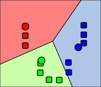

K-Means Clustering (Lloyd's algorithm)
======================================

K-Means is an unsupervised machine learning algorithm used to partition a
dataset into a fixed number of groups called `clusters`. The objective is to
have clusters which contains points which are similar to each other. The
algorithm alternates between assigning points to their nearest centroid and
recomputing the centroids as the mean of their assigned points [Lloyd1982]_.

   Figure 1: Converged state of k-means algorithm. [WestonPace]_

Algorithm
---------

Given a dataset :math:`X = {x_1, x_2, \ldots, x_n}` and a desired number of
clusters :math:`k`, K-Means proceeds as follows:

1. Initialize :math:`k` centroids :math:`\mu_1, \mu_2, \ldots, \mu_k`.

2. Assign each data point :math:`x_i` to the nearest centroid:

    .. math::

        c_i \leftarrow \underset{j \in \{1, \ldots, k\}}{\operatorname{argmin}}
        \|x_i - \mu_j\|^2

3. Update each centroid by taking the mean of all the points assigned to it:

    .. math::

        \mu_j \leftarrow
        \frac{1}{|\{i : c_i = j\}|}
        \sum_{i:c_i=j} x_i

4. Repeat steps 2 and 3 until the clusters assignments converge.

Distance and Cluster Assignment
-------------------------------

The first step of each K-Means iteration is to assign every data point to the
nearest centroid. This requires computing the distance between a point and each
centroid and selecting the centroid with the smallest distance.

Squared Euclidean Distance
~~~~~~~~~~~~~~~~~~~~~~~~~~

For a point :math:`x` and centroid :math:`\mu`, the squared Euclidean distance
is

.. math:: d(x, \mu) = \|x - \mu\|^2 = \sum_{c=1}^{D} (x_c - \mu_c)^2

where :math:`D` is the number of dimensions.

The square root normally used in Euclidean distance is not required here
because the square-root function is monotonic. Therefore, the centroid that
minimizes the squared distance is also the centroid that minimizes the
Euclidean distance.

Finding the Nearest Centroid
~~~~~~~~~~~~~~~~~~~~~~~~~~~~

For each data point :math:`x_i`, K-Means assigns the point to the
centroid with the minimum distance:

.. math::

    c_i =
    \underset{j \in \{1,\ldots,k\}}{\operatorname{argmin}}
    \|x_i - \mu_j\|^2

Objective Function
------------------

The objective of K-Means is to partition the dataset into :math:`k`
clusters such that points within the same cluster are as close to their
cluster centroid as possible. This is achieved by minimizing the
within-cluster sum of squared distances (WCSS), also known as the
K-Means objective function:

.. math::

    J = \sum_{i=1}^{n} \left\|x_i - \mu_{c_i}\right\|^2

where :math:`x_i` is the :math:`i`-th data point, :math:`c_i` is the
cluster assigned to that point, and :math:`\mu_{c_i}` is the centroid of
that cluster.

Equivalently, the objective can be written as a sum over all clusters:

.. math::

    J = \sum_{j=1}^{k} \sum_{x_i \in C_j}
        \left\|x_i - \mu_j\right\|^2

A lower value of :math:`J` indicates that the points are, on average,
closer to their assigned centroids. Lloyd's algorithm minimizes this
objective by repeatedly alternating between assigning points to their
nearest centroid and recomputing each centroid as the mean of its
assigned points.

Convergence
-----------

Lloyd's algorithm alternates between assignment and centroid updates until the
assignments stop changing. The implementation detects this by comparing the
current labels with the labels from the previous iteration.

If

.. math::

    \sum_i |c_i^{(t)} - c_i^{(t-1)}| = 0,

then no point has changed clusters and the algorithm has converged.

Complexity
----------

For :math:`n` points, :math:`k` clusters, and :math:`d` dimensions, each
assignment step requires :math:`O(nkd)` operations.

The centroid update also requires :math:`O(nd)` work for each cluster in the
implementation, giving an overall per-iteration complexity of approximately
:math:`O(nk + nkd)` i.e. :math:`O(nkd)`.

Helper Functions
----------------

``absolute`` function computes the element-wise absolute value of a vector.
It uses the identity:

.. math:: |a| = \sqrt{a^2}

.. code-block:: text
    
    def absolute(a: ℝ[m]): ℝ[m]:
        return sqrt(a * a)

``get_sum_of_1d_array`` function computes the sum of all elements in a
one-dimensional array:

.. math::

    s = \sum_{i=1}^{m} x_i

It performs the reduction explicitly using a loop:

.. code-block:: text

    def get_sum_of_1d_array(x: ℝ[m]): ℝ:
        total: ℝ = 0
        for i:
            total += x[i]
        return total

Function Summary
----------------

.. list-table::
   :header-rows: 1
   :widths: 25 75

   * - Function
     - Description
   * - ``sq_dist(a, b)``
     - Returns the Squared Euclidean distance between 2 positions.
   * - ``argmin_vec(v)``
     - Returns the index of the elements in `v` with the smallest absolute value.
   * - ``assign_one(point, C)``
     - Assigns a centroid nearest to the point.
   * - ``assign_labels(X, C)``
     - Assigns label to all the points using `assign_one` function.
   * - ``new_centroid(X, labels, target, fallback)``
     - Returns mean of all points in X assigned to the target cluster.
   * - ``update_centroids(X, labels, C_old)``
     - Assigns new centroids using the `new_centroid` function.
   * - ``data_min(X)``
     - Computes the element-wise minimum value across all points in X.
   * - ``data_max(X)``
     - Computes the element-wise maximum value across all points in X.
   * - ``rand_centroid(hi, lo)``
     - Generates a random centroid within the element-wise bounding box defined by lo and hi.
   * - ``absolute(a)``
     - Returns the absolute value of the input.
   * - ``get_sum_of_1d_array(x)``
     - Returns the sum of the elements of a 1-D array.

Full Code
---------

    .. code-block:: text
        
        SEED:  ℝ = 2
        K:     ℝ = 2
        DIM:   ℝ = 2
        NPTS:  ℝ = 15
        ITERS: ℕ = 50

        physika.seed(SEED)

        def absolute(a: ℝ[m]): ℝ[m]:
            return sqrt(a * a)

        def get_sum_of_1d_array(x: ℝ[m]): ℝ:
            total: ℝ = 0
            for i:
                total += x[i]
            return total

        def sq_dist(a: ℝ[DIM], b: ℝ[DIM]): ℝ:
            acc: ℝ = 0.0
            for c:ℕ(DIM):
                acc += (a[c] - b[c]) * (a[c] - b[c])
            return acc

        def argmin_vec(v: ℝ[K]): ℝ:
            av: ℝ[K] = absolute(v)
            best_j: ℝ = 0.0
            best_v: ℝ = av[0]
            for j:ℕ(K):
                if av[j] < best_v:
                    best_v = av[j]
                    best_j = j
            return best_j

        def assign_one(point: ℝ[DIM], C: ℝ[K, DIM]): ℝ:
            dists: ℝ[K] = for j:ℕ(K) -> sq_dist(point, C[j])
            return argmin_vec(dists)

        def assign_labels(X: ℝ[NPTS, DIM], C: ℝ[K, DIM]): ℝ[NPTS]:
            return for i:ℕ(NPTS) -> assign_one(X[i], C)

        def new_centroid(X: ℝ[NPTS, DIM], labels: ℝ[NPTS], target: ℝ, fallback: ℝ[DIM]): ℝ[DIM]:
            sums: ℝ[DIM] = for c:ℕ(DIM) -> c * 0.0
            cnt: ℝ = 0.0
            for i:ℕ(NPTS):
                if labels[i] == target:
                    sums = sums + X[i]
                    cnt += 1.0
            if cnt > 0.0:
                return sums / cnt
            else:
                return fallback

        def update_centroids(X: ℝ[NPTS, DIM], labels: ℝ[NPTS], C_old: ℝ[K, DIM]): ℝ[K, DIM]:
            return for j:ℕ(K) -> new_centroid(X, labels, j, C_old[j])

        def data_min(X: ℝ[NPTS, DIM]): ℝ[DIM]:
            m: ℝ[DIM] = X[0]
            for i:ℕ(NPTS):
                m = (m + X[i] - absolute(m - X[i])) * 0.5
            return m

        def data_max(X: ℝ[NPTS, DIM]): ℝ[DIM]:
            m: ℝ[DIM] = X[0]
            for i:ℕ(NPTS):
                m = (m + X[i] + absolute(m - X[i])) * 0.5
            return m

        def rand_centroid(lo: ℝ[DIM], hi: ℝ[DIM]): ℝ[DIM]:
            s: ℝ[DIM] ~ 𝒰(0.0, 1.0, DIM)
            return lo + s * (hi - lo)

        X: ℝ[15, 2] = [
            [2.0, 2.2], [2.8, 2.9], [1.9, 3.1], [3.1, 2.0], [2.5, 2.6],
            [3.6, 3.1], [4.1, 2.7], [3.3, 3.4], [4.0, 3.6], [3.7, 2.9],
            [3.0, 4.0], [2.7, 3.9], [3.4, 4.2], [2.9, 3.5], [3.2, 3.7]
        ]

        lo_box: ℝ[DIM] = data_min(X)
        hi_box: ℝ[DIM] = data_max(X)
        C: ℝ[K, DIM] = for j:ℕ(K) -> rand_centroid(lo_box, hi_box)

        prev_labels:  ℝ[NPTS] = for i:ℕ(NPTS) -> i * 0.0 - 1.0
        labels:       ℝ[NPTS] = for i:ℕ(NPTS) -> i * 0.0
        converged_at: ℝ = 0.0 - 1.0

        for step:ℕ(ITERS):
            labels = assign_labels(X, C)
            moved = get_sum_of_1d_array(absolute(labels - prev_labels))
            if moved == 0.0:
                if converged_at < 0.0:
                    converged_at = step
            else:
                C = update_centroids(X, labels, C)
            prev_labels = labels

        print(converged_at)
        print(labels)
        print(C)

References
----------

.. [Lloyd1982] Stuart P. Lloyd. "Least squares quantization in PCM."
   IEEE Transactions on Information Theory, 28(2), 129-137, 1982.
   DOI: 10.1109/TIT.1982.1056489.

.. [WestonPace] Weston.pace. Own work. CC BY-SA 3.0.
   Wikimedia Commons.
   https://commons.wikimedia.org/w/index.php?curid=2463085
